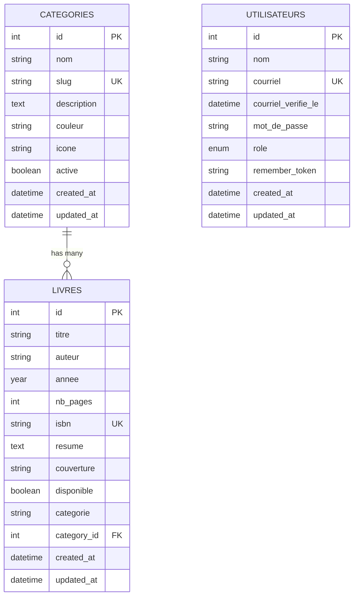

# 📊 Séance 2 — Base de Données SQLite & CI/CD

**Duré### **5. TP Pratique : Exercices Complets**
💻 **[05-TP-PRATIQUE-EXERCICES.md](05-TP-PRATIQUE-EXERCICES.md)**
- 5 modules d'exercices progressifs
- Migrations → Modèles → Relations → Requêtes avancées
- Tests de performance et optimisation
- Validation autonome des compétences3 heures  
**Objectif :** Remplacer les données en dur par une vraie base de données SQLite avec pipeline CI/CD

## 🎤 Support de Présentation
📽️ **[PRÉSENTATION ENSEIGNANT](00-PRESENTATION-SEANCE-02.md)** - Support de cours au format diapo pour présenter la séance (Marp/reveal.js compatible)
👨‍🏫 **[GUIDE ENSEIGNANT](00-GUIDE-ENSEIGNANT.md)** - Instructions détaillées pour utiliser la présentation et animer la séance

## 📚 Organisation Pédagogique
📖 **[ORGANISATION PÉDAGOGIQUE](00-ORGANISATION-PEDAGOGIQUE.md)** - Guide pour comprendre la structure et la différence entre TP guidé et TP autonome

---

## 🎯 Objectifs de la Séance

À l'issue de cette séance, vous serez capable de :

- ✅ **Créer des migrations Laravel** pour structurer la base SQLite
- ✅ **Développer des modèles Eloquent** avec relations entre tables  
- ✅ **Utiliser les seeders** pour alimenter SQLite avec des données de test
- ✅ **Manipuler SQLite** via Tinker et les requêtes Eloquent
- ✅ **Configurer un pipeline CI/CD** avec GitHub Actions
- ✅ **Comprendre les relations** one-to-many (livre → catégorie)

---

## � Parcours Pédagogique Structuré

### **1. Concepts Fondamentaux**
📖 **[01-CONCEPTS-DATABASE.md](01-CONCEPTS-DATABASE.md)**
- SQLite vs autres SGBD
- Architecture relationnelle  
- Migrations et Schema Builder
- Eloquent ORM et Active Record

### **2. Vocabulaire Technique**
📝 **[02-GLOSSAIRE-ELOQUENT.md](02-GLOSSAIRE-ELOQUENT.md)**
- Terminologie base de données
- Glossaire Eloquent ORM
- Relations et clés étrangères
- Conventions Laravel

### **3. Découverte Pratique**  
🔍 **[03-DECOUVERTE-DATABASE.md](03-DECOUVERTE-DATABASE.md)**
- Explorer la structure SQLite
- Naviguer avec Tinker
- Tester les relations existantes
- Analyser les données

### **4. TP Pratique : Migrations**
🛠️ **[04-TP-PRATIQUE-MIGRATIONS.md](04-TP-PRATIQUE-MIGRATIONS.md)**
- Créer des migrations pas à pas
- Modifier des tables existantes
- Gérer les relations complexes
- Rollback et maintenance

### **5. Exercices Approfondis**
� **[05-EXERCICES-PRATIQUES.md](05-EXERCICES-PRATIQUES.md)**
- Exercices progressifs (5 modules)
- Migrations → Modèles → Relations → Requêtes avancées
- Tests de performance et optimisation
- Validation des compétences

### **6. Évaluation Finale**
� **[06-EVALUATION-COMPETENCES.md](06-EVALUATION-COMPETENCES.md)**
- Test pratique 45 minutes
- 20 points sur 5 parties
- Validation des acquis
- Certification des compétences

### **7. CI/CD et Déploiement**
🚀 **[07-CICD-GITHUB-ACTIONS.md](07-CICD-GITHUB-ACTIONS.md)**
- Pipeline GitHub Actions
- Tests automatisés SQLite
- Analyse qualité et sécurité
- Déploiement automatique

### **8. Guide de Démarrage Rapide**
⚡ **[08-QUICK-START-SQLITE.md](08-QUICK-START-SQLITE.md)**
- Installation express 2 minutes
- Configuration SQLite automatique
- Tests de validation rapides

---

## 🚀 Prérequis

### **✅ Vérifications Initiales**

```bash
# Vérifier la branche actuelle
git branch
# Devrait afficher : * seance-02-database-sqlite

# Vérifier que SQLite fonctionne
touch database/database.sqlite
php artisan migrate:status
```

### **🔧 Commandes SQLite Essentielles**

```bash
# Créer le fichier SQLite vide
touch database/database.sqlite

# Lancer toutes les migrations
php artisan migrate

# Vérifier l'état des migrations  
php artisan migrate:status

# Rollback de la dernière migration
php artisan migrate:rollback

# Refresh complet (reset + migrate)
php artisan migrate:fresh

# Refresh avec seeders
php artisan migrate:fresh --seed
```

---

## 🏗️ Structure de Base de Données

### **📊 Schéma SQLite Final**



### **🔧 Migrations Créées**

| Fichier | Table | Description |
|---------|-------|-------------|
| `create_categories_table.php` | categories | Catégories de livres avec couleurs et icônes |
| `create_livres_table.php` | livres | Livres avec métadonnées complètes |  
| `add_category_id_to_livres_table.php` | livres | Relation vers les catégories |
| `create_utilisateurs_table.php` | utilisateurs | Utilisateurs avec rôles |

---

## 💻 Exercices Pratiques

### **🎯 Exercice 1 : Vérification des Migrations (20 min)**

```bash
# 1. Vérifier les migrations existantes
php artisan migrate:status

# 2. Examiner la structure SQLite
php artisan tinker
>>> Schema::getColumnListing('livres')
>>> Schema::getColumnListing('categories')

# 3. Tester les contraintes
>>> DB::select("PRAGMA foreign_key_list(livres)")
```

**Résultat attendu :**
- ✅ Toutes migrations marquées "Ran"
- ✅ Tables livres, categories, utilisateurs créées
- ✅ Clé étrangère category_id configurée

### **🎯 Exercice 2 : Test des Modèles Eloquent (30 min)**

```php
// Dans php artisan tinker
// 1. Créer une catégorie
$cat = new App\Models\Category();
$cat->nom = "Test PHP";
$cat->description = "Livres sur PHP";
$cat->couleur = "#777BB4";
$cat->save();

// 2. Vérifier le slug automatique
echo $cat->slug; // Devrait afficher "test-php"

// 3. Créer un livre lié
$livre = App\Models\Livre::create([
    'titre' => 'PHP Avancé',
    'auteur' => 'Expert Dev',
    'category_id' => $cat->id,
    'disponible' => true
]);

// 4. Tester la relation
$livre->category->nom; // "Test PHP"
$cat->livres()->count(); // 1
```

### **🎯 Exercice 3 : Seeders et Relations (40 min)**

```bash
# 1. Vider et repeupler la base
php artisan migrate:fresh

# 2. Lancer uniquement CategorySeeder
php artisan db:seed --class=CategorySeeder

# 3. Vérifier les catégories créées
php artisan tinker
>>> App\Models\Category::all()->pluck('nom')

# 4. Lancer LivreSeeder
php artisan db:seed --class=LivreSeeder

# 5. Tester les relations
>>> App\Models\Livre::with('category')->get()
```

### **🎯 Exercice 4 : Requêtes Avancées (30 min)**

```php
// Dans Tinker - Requêtes Eloquent avancées

// 1. Livres disponibles d'une catégorie
App\Models\Livre::disponible()
    ->whereHas('category', function($q) {
        $q->where('slug', 'laravel');
    })->get();

// 2. Catégories avec nombre de livres
App\Models\Category::withCount('livres')->get();

// 3. Recherche dans les livres
App\Models\Livre::recherche('Laravel')->get();

// 4. Livres par catégorie (scope)
App\Models\Livre::parCategorie('php')->get();
```

---

## 🚀 CI/CD avec GitHub Actions

### **📋 Pipeline Automatisé**

Le fichier `.github/workflows/ci.yml` configure :

```yaml
🧪 Tests automatisés (PHP 8.3, 8.4)
🔍 Analyse statique (PHPStan)  
🎨 Style de code (Laravel Pint)
🔒 Audit de sécurité (Composer)
📊 Coverage des tests (Codecov)
🚀 Déploiement staging automatique
⚡ Tests de performance
```

### **⚙️ Commandes CI/CD Locales**

```bash
# Tests comme sur GitHub Actions
php artisan test --coverage

# Analyse statique
composer require --dev phpstan/phpstan
./vendor/bin/phpstan analyse

# Style de code
./vendor/bin/pint --test

# Audit de sécurité
composer audit
```

---

## 🔍 Validation et Tests

### **✅ Critères de Validation**

#### **Base de Données SQLite**
- [ ] Fichier `database/database.sqlite` existe et n'est pas vide
- [ ] Tables `categories`, `livres`, `utilisateurs` créées  
- [ ] Relations fonctionnelles entre livres et catégories
- [ ] Index créés pour optimiser les requêtes

#### **Modèles Eloquent**
- [ ] Modèle `Category` avec relations et scopes
- [ ] Modèle `Livre` mis à jour avec relation `belongsTo`
- [ ] Mass assignment configuré (`$fillable`)
- [ ] Casts appropriés pour les types de données

#### **Seeders**
- [ ] 6 catégories créées avec couleurs et icônes
- [ ] 6 livres créés avec relations vers catégories
- [ ] Données cohérentes et réalistes
- [ ] Relations correctement établies

### **🧪 Tests de Validation**

```bash
# Test 1 : Structure de base
php artisan tinker --execute="
    echo 'Categories: ' . App\Models\Category::count() . PHP_EOL;
    echo 'Livres: ' . App\Models\Livre::count() . PHP_EOL;
    echo 'Relations: ' . App\Models\Livre::whereNotNull('category_id')->count();
"

# Test 2 : Intégrité des données
php artisan tinker --execute="
    \$livre = App\Models\Livre::with('category')->first();
    echo 'Livre: ' . \$livre->titre . PHP_EOL;
    echo 'Catégorie: ' . \$livre->category?->nom ?? 'Aucune';
"

# Test 3 : Pipeline CI/CD
git add .
git commit -m "✅ Séance 2: Base SQLite avec relations"
git push origin seance-02-database-sqlite
# ➜ Vérifier GitHub Actions
```

---

## 📚 Ressources et Documentation

### **📖 Documentation Laravel**
- [Migrations Laravel](https://laravel.com/docs/11.x/migrations)
- [Eloquent ORM](https://laravel.com/docs/11.x/eloquent)  
- [Relations Eloquent](https://laravel.com/docs/11.x/eloquent-relationships)
- [Database Seeding](https://laravel.com/docs/11.x/seeding)

### **🔧 SQLite Resources**
- [SQLite avec Laravel](https://laravel.com/docs/11.x/database#sqlite-configuration)
- [SQLite Foreign Keys](https://www.sqlite.org/foreignkeys.html)
- [SQLite Performance Tips](https://www.sqlite.org/optoverview.html)

### **🚀 CI/CD Resources**  
- [GitHub Actions pour Laravel](https://github.com/features/actions)
- [Laravel Testing](https://laravel.com/docs/11.x/testing)

---

## 🎓 Préparation Séance 3

### **Prérequis pour la Suite**

### **Aperçu Séance 3 : CRUD + Formulaires**


**🎉 Félicitations ! Vous maîtrisez maintenant SQLite avec Laravel et les pipelines CI/CD !**

> 💡 **Conseil** : Pratiquez les requêtes Eloquent dans Tinker pour bien comprendre l'ORM avant la prochaine séance.

Dernière mise à jour: 6 octobre 2025