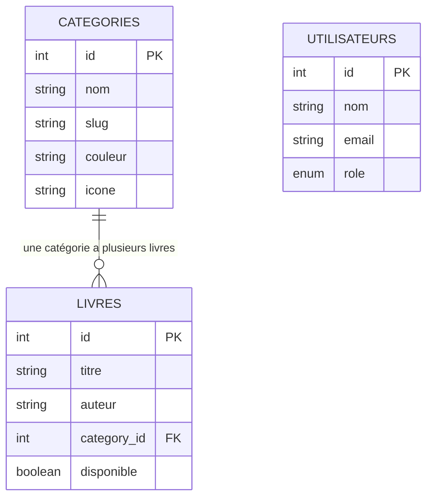
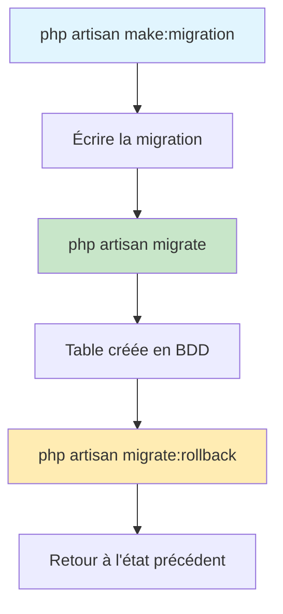

# 🗃️ Concepts Base de Données avec Laravel

**Comprendre SQLite, Eloquent ORM et les relations entre données**

---

## 🎯 Objectifs du Module

À la fin de ce module, vous maîtriserez :
- ✅ **SQLite** : Base de données légère et portable
- ✅ **Migrations Laravel** : Gestion de la structure de base
- ✅ **Eloquent ORM** : Mapping objet-relationnel
- ✅ **Relations** : Liens entre les tables (belongsTo, hasMany)
- ✅ **Seeders** : Peuplage automatique de données

---

## 📊 Qu'est-ce qu'une Base de Données ?

### **🔗 Analogie Simple**

Imaginez une **bibliothèque physique** :
```
📚 BIBLIOTHÈQUE (= Base de Données)
├── 📋 Fichier des CATÉGORIES (= Table categories)
│   ├── Fiction, Non-fiction, Science...
├── 📋 Fichier des LIVRES (= Table livres) 
│   ├── Titre, Auteur, ISBN, Catégorie...
└── 📋 Fichier des UTILISATEURS (= Table utilisateurs)
    ├── Nom, Email, Rôle...
```

### **🏗️ Structure Relationnelle**



---

## 🪶 Pourquoi SQLite pour ce Projet ?

### **✅ Avantages SQLite**

| 🎯 Critère | 🪶 SQLite | 🐘 PostgreSQL | 🐬 MySQL |
|------------|-----------|---------------|----------|
| **Installation** | ✅ Aucune | ❌ Serveur requis | ❌ Serveur requis |
| **Portabilité** | ✅ Un seul fichier | ❌ Dump/Restore | ❌ Dump/Restore |
| **Configuration** | ✅ Zéro config | ❌ Complexe | ❌ Complexe |
| **Formation** | ✅ Idéal débutants | ❌ Production | ❌ Production |
| **GitHub Codespace** | ✅ Parfait | ⚠️ Setup requis | ⚠️ Setup requis |

### **🎯 SQLite dans Laravel**

```bash
# Configuration dans .env
DB_CONNECTION=sqlite
DB_DATABASE=database/database.sqlite

# Un seul fichier contient toute la base !
ls -la database/database.sqlite
# -rw-r--r-- 1 user user 12288 Sep 26 database.sqlite
```

---

## 🗂️ Migrations Laravel

### **📋 Concept des Migrations**

Les migrations sont comme un **système de contrôle de version pour votre base de données** :

```php
// Créer une table
Schema::create('categories', function (Blueprint $table) {
    $table->id();                    // Clé primaire auto-incrémentée
    $table->string('nom');           // Colonne texte obligatoire
    $table->string('slug')->unique(); // Colonne texte unique
    $table->text('description')->nullable(); // Texte long optionnel
    $table->timestamps();            // created_at, updated_at automatiques
});
```

### **🔄 Cycle de Vie des Migrations**



### **💻 Commandes Essentielles**

```bash
# Créer une nouvelle migration
php artisan make:migration create_categories_table

# Lancer toutes les migrations
php artisan migrate

# Voir l'état des migrations
php artisan migrate:status

# Annuler la dernière migration
php artisan migrate:rollback

# Reset complet + relancer
php artisan migrate:fresh
```

---

## 🎭 Eloquent ORM : L'Art de la Magie

### **🧙‍♂️ ORM = Object-Relational Mapping**

L'ORM traduit entre le **monde des objets PHP** et le **monde des tables SQL** :

```php
// ❌ SQL brut (compliqué)
$result = DB::select("
    SELECT l.*, c.nom as categorie_nom 
    FROM livres l 
    JOIN categories c ON l.category_id = c.id 
    WHERE l.disponible = 1
");

// ✅ Eloquent ORM (magique !)
$livres = Livre::with('category')
    ->where('disponible', true)
    ->get();
```

### **🏗️ Modèle Eloquent**

```php
class Livre extends Model
{
    // 🔗 Relation : Ce livre appartient à une catégorie
    public function category()
    {
        return $this->belongsTo(Category::class);
    }
    
    // 🔍 Scope : Filtrer les livres disponibles
    public function scopeDisponible($query)
    {
        return $query->where('disponible', true);
    }
    
    // 🛡️ Protection mass assignment
    protected $fillable = [
        'titre', 'auteur', 'category_id', 'disponible'
    ];
}
```

### **🔗 Types de Relations**

#### **belongsTo (Appartient à)**
```php
// Un livre appartient à UNE catégorie
class Livre extends Model
{
    public function category()
    {
        return $this->belongsTo(Category::class);
    }
}

// Utilisation
$livre = Livre::find(1);
echo $livre->category->nom; // "Laravel"
```

#### **hasMany (Possède plusieurs)**
```php
// Une catégorie possède PLUSIEURS livres
class Category extends Model
{
    public function livres()
    {
        return $this->hasMany(Livre::class);
    }
}

// Utilisation
$category = Category::find(1);
echo $category->livres->count(); // 3 livres
```

---

## 🌱 Seeders : Peupler la Base

### **🎯 Pourquoi des Seeders ?**

Les seeders permettent de :
- ✅ **Créer des données de test** cohérentes
- ✅ **Partager des données** entre développeurs
- ✅ **Réinitialiser** rapidement la base
- ✅ **Démontrer** l'application avec du contenu

### **🌰 Exemple CategorySeeder**

```php
class CategorySeeder extends Seeder
{
    public function run(): void
    {
        $categories = [
            [
                'nom' => 'Laravel',
                'description' => 'Framework PHP moderne et élégant',
                'couleur' => '#FF6B6B',
                'icone' => 'fab fa-laravel',
                'active' => true
            ],
            [
                'nom' => 'Vue.js',
                'description' => 'Framework JavaScript progressif',
                'couleur' => '#4FC08D',
                'icone' => 'fab fa-vuejs',
                'active' => true
            ]
        ];
        
        foreach ($categories as $category) {
            Category::create($category);
        }
    }
}
```

### **🔄 Ordre d'Exécution Important**

```php
// DatabaseSeeder.php
public function run(): void
{
    // ⚠️ ORDRE IMPORTANT : Categories AVANT Livres
    $this->call([
        CategorySeeder::class,  // 1️⃣ D'abord les catégories
        LivreSeeder::class,     // 2️⃣ Puis les livres (qui référencent les catégories)
    ]);
}
```

---

## ⚡ Requêtes Eloquent Optimisées

### **🚫 Problème N+1**

```php
// ❌ LENT : Une requête par livre (problème N+1)
$livres = Livre::all();
foreach ($livres as $livre) {
    echo $livre->category->nom; // Requête SQL à chaque itération !
}
// Total : 1 requête + N requêtes = Performance catastrophique
```

### **✅ Solution : Eager Loading**

```php
// ✅ RAPIDE : Deux requêtes seulement
$livres = Livre::with('category')->get();
foreach ($livres as $livre) {
    echo $livre->category->nom; // Aucune requête supplémentaire !
}
// Total : 2 requêtes = Performance optimale
```

### **🔍 Exemples de Requêtes Pratiques**

```php
// Recherche
$livres = Livre::where('titre', 'like', '%Laravel%')
    ->orWhere('auteur', 'like', '%Laravel%')
    ->get();

// Relation avec comptage
$categories = Category::withCount('livres')
    ->orderBy('livres_count', 'desc')
    ->get();

// Filtrage par relation
$livres = Livre::whereHas('category', function ($query) {
    $query->where('nom', 'Laravel');
})->get();

// Scopes chainés
$livres = Livre::disponible()
    ->with('category')
    ->latest()
    ->limit(5)
    ->get();
```

---

## 🛠️ Outils de Debug

### **🔍 Laravel Tinker**

```bash
# Console interactive pour tester
php artisan tinker

# Exemples dans Tinker
>>> App\Models\Category::count()
=> 6

>>> App\Models\Livre::with('category')->first()
=> App\Models\Livre {#4567 ...}

>>> DB::enableQueryLog()
>>> App\Models\Livre::with('category')->get()
>>> DB::getQueryLog()
```

### **📊 Analyse des Requêtes**

```php
// Activer le log des requêtes
DB::enableQueryLog();

// Votre code Eloquent
$livres = Livre::with('category')->get();

// Voir toutes les requêtes exécutées
$queries = DB::getQueryLog();
foreach ($queries as $query) {
    echo $query['query'] . PHP_EOL;
}
```

---

## ✅ Checklist de Compréhension

### **📋 Concepts Fondamentaux**
- [ ] Je comprends la différence entre SQLite et MySQL/PostgreSQL
- [ ] Je sais ce qu'est une migration et pourquoi c'est utile
- [ ] Je comprends le principe de l'ORM Eloquent
- [ ] Je distingue les relations belongsTo et hasMany

### **💻 Compétences Techniques**
- [ ] Je sais créer et lancer des migrations
- [ ] Je peux écrire des modèles Eloquent avec relations
- [ ] Je maîtrise les seeders et leur ordre d'exécution
- [ ] Je sais optimiser les requêtes avec Eager Loading

### **🔍 Debug et Analyse**
- [ ] J'utilise Tinker pour tester mes modèles
- [ ] Je peux analyser les requêtes SQL générées
- [ ] Je détecte et corrige le problème N+1
- [ ] Je valide l'intégrité de mes données

---

## 🚀 Étapes Suivantes

Maintenant que vous comprenez les concepts, passez aux **exercices pratiques** :

1. **🛠️ TP Migrations** → [04-TP-MIGRATIONS.md](04-TP-MIGRATIONS.md)
2. **💪 Exercices** → [05-EXERCICES-PRATIQUES.md](05-EXERCICES-PRATIQUES.md)
3. **✅ Évaluation** → [06-EVALUATION-COMPETENCES.md](06-EVALUATION-COMPETENCES.md)

> 💡 **Conseil :** N'hésitez pas à expérimenter avec Tinker pour bien assimiler ces concepts !