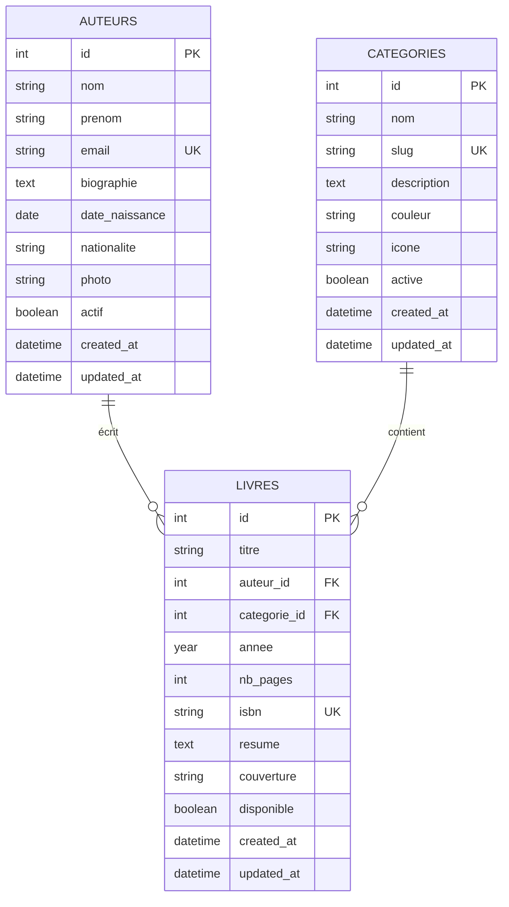

# 🛠️ TP Pratique : Migrations Laravel

**Apprendre à créer et modifier la structure de base de données avec Laravel**

---

## 🎯 Objectifs du TP

À la fin de ce TP, vous saurez :
- ✅ **Créer** de nouvelles migrations Laravel
- ✅ **Modifier** des tables existantes
- ✅ **Gérer** les clés étrangères et contraintes
- ✅ **Utiliser** les types de colonnes appropriés
- ✅ **Tester** et **valider** vos migrations

**⏱️ Durée estimée :** 60 minutes

---

## 🚀 Préparation

### **✅ Vérifications Initiales**

```bash
# 1. Vérifier l'état des migrations actuelles
php artisan migrate:status

# 2. Sauvegarder la base actuelle (précaution)
cp database/database.sqlite database/backup_$(date +%Y%m%d_%H%M%S).sqlite

# 3. Vérifier que les modèles existants fonctionnent
php artisan tinker --execute="echo 'Categories: ' . App\Models\Categorie::count() . PHP_EOL;"
```

---

## 🏗️ Partie 1 : Créer une Migration Simple (15 min)

### **🛠️ Exercice 1.1 : Ajouter la Table "Auteurs"**

**Objectif :** Créer une table séparée pour les auteurs au lieu de stocker le nom dans la table livres.

```bash
# 1. Créer la migration
php artisan make:migration create_auteurs_table
```

**📝 Ouvrir le fichier généré** dans `database/migrations/[timestamp]_create_auteurs_table.php` :

```php
<?php

use Illuminate\Database\Migrations\Migration;
use Illuminate\Database\Schema\Blueprint;
use Illuminate\Support\Facades\Schema;

return new class extends Migration
{
    public function up(): void
    {
        Schema::create('auteurs', function (Blueprint $table) {
            $table->id();
            $table->string('nom');
            $table->string('prenom');
            $table->string('email')->unique()->nullable();
            $table->text('biographie')->nullable();
            $table->date('date_naissance')->nullable();
            $table->string('nationalite')->nullable();
            $table->string('photo')->nullable();
            $table->boolean('actif')->default(true);
            $table->timestamps();
            
            // Index pour améliorer les performances de recherche
            $table->index(['nom', 'prenom']);
            $table->index('nationalite');
        });
    }

    public function down(): void
    {
        Schema::dropIfExists('auteurs');
    }
};
```

```bash
# 2. Exécuter la migration
php artisan migrate

# 3. Vérifier que la table a été créée
php artisan tinker --execute="Schema::getColumnListing('auteurs')"
```

**📝 Questions :**
- Quels types de colonnes avez-vous utilisés et pourquoi ?
- Pourquoi certaines colonnes sont-elles `nullable()` ?
- À quoi servent les index créés ?

### **🛠️ Exercice 1.2 : Tester la Migration**

```bash
# Dans Tinker
php artisan tinker
```

```php
// 1. Vérifier la structure
>>> Schema::getColumnListing('auteurs')

// 2. Créer un auteur de test
>>> $auteur = new App\Models\Auteur()  // ⚠️ Le modèle n'existe pas encore !
```

**❌ Erreur attendue :** `Class "App\Models\Auteur" not found`

**✅ Solution :** Nous créerons le modèle dans la partie suivante.

---

## 📝 Partie 2 : Créer le Modèle Correspondant (10 min)

### **🛠️ Exercice 2.1 : Générer le Modèle Auteur**

```bash
# 1. Créer le modèle
php artisan make:model Auteur
```

**📝 Modifier le fichier** `app/Models/Auteur.php` :

```php
<?php

namespace App\Models;

use Illuminate\Database\Eloquent\Model;
use Illuminate\Database\Eloquent\Factories\HasFactory;

class Auteur extends Model
{
    use HasFactory;
    
    protected $table = 'auteurs';
    
    protected $fillable = [
        'nom',
        'prenom', 
        'email',
        'biographie',
        'date_naissance',
        'nationalite',
        'photo',
        'actif'
    ];
    
    protected $casts = [
        'date_naissance' => 'date',
        'actif' => 'boolean'
    ];
    
    // Relation : Un auteur peut écrire plusieurs livres
    public function livres()
    {
        return $this->hasMany(Livre::class);
    }
    
    // Scope : Auteurs actifs
    public function scopeActif($query)
    {
        return $query->where('actif', true);
    }
    
    // Accessor : Nom complet
    public function getNomCompletAttribute()
    {
        return $this->prenom . ' ' . $this->nom;
    }
}
```

### **🛠️ Exercice 2.2 : Tester le Modèle**

```bash
php artisan tinker
```

```php
// 1. Tester la création d'un auteur
>>> $auteur = App\Models\Auteur::create([
    'nom' => 'Doe',
    'prenom' => 'John',
    'email' => 'john.doe@example.com',
    'biographie' => 'Auteur renommé de livres techniques',
    'nationalite' => 'Française'
]);

// 2. Tester l'accessor
>>> $auteur->nom_complet

// 3. Tester le scope
>>> App\Models\Auteur::actif()->count()

// 4. Vérifier les casts
>>> $auteur->date_naissance  // Doit être null ou instance Carbon
>>> $auteur->actif           // Doit être boolean true
```

---

## 🔗 Partie 3 : Modifier une Table Existante (20 min)

### **🛠️ Exercice 3.1 : Ajouter la Relation Livre → Auteur**

**Objectif :** Modifier la table `livres` pour remplacer la colonne `auteur` (string) par `auteur_id` (foreign key).

```bash
# 1. Créer la migration de modification
php artisan make:migration add_auteur_id_to_livres_table
```

**📝 Modifier le fichier** `database/migrations/[timestamp]_add_auteur_id_to_livres_table.php` :

```php
<?php

use Illuminate\Database\Migrations\Migration;
use Illuminate\Database\Schema\Blueprint;
use Illuminate\Support\Facades\Schema;

return new class extends Migration
{
    public function up(): void
    {
        Schema::table('livres', function (Blueprint $table) {
            // Ajouter la clé étrangère vers auteurs
            $table->foreignId('auteur_id')->nullable()->after('auteur')->constrained('auteurs')->onDelete('set null');
            
            // Note: On garde temporairement la colonne 'auteur' pour la migration des données
        });
    }

    public function down(): void
    {
        Schema::table('livres', function (Blueprint $table) {
            $table->dropForeign(['auteur_id']);
            $table->dropColumn('auteur_id');
        });
    }
};
```

```bash
# 2. Exécuter la migration
php artisan migrate

# 3. Vérifier la structure modifiée
php artisan tinker --execute="Schema::getColumnListing('livres')"
```

### **🛠️ Exercice 3.2 : Migrer les Données Existantes**

Nous devons maintenant transférer les noms d'auteurs existants vers la nouvelle table.

```bash
# Créer une migration de données
php artisan make:migration migrate_existing_auteurs_data
```

**📝 Fichier de migration** `database/migrations/[timestamp]_migrate_existing_auteurs_data.php` :

```php
<?php

use Illuminate\Database\Migrations\Migration;
use App\Models\Livre;
use App\Models\Auteur;

return new class extends Migration
{
    public function up(): void
    {
        // Récupérer tous les livres avec leurs auteurs actuels
        $livres = Livre::whereNotNull('auteur')->get();
        
        foreach ($livres as $livre) {
            $nomAuteur = trim($livre->auteur);
            
            if (empty($nomAuteur)) continue;
            
            // Séparer prénom et nom (approximatif)
            $parts = explode(' ', $nomAuteur, 2);
            $prenom = $parts[0];
            $nom = isset($parts[1]) ? $parts[1] : '';
            
            // Chercher ou créer l'auteur
            $auteur = Auteur::firstOrCreate(
                [
                    'nom' => $nom ?: $prenom,
                    'prenom' => $nom ? $prenom : '',
                ],
                [
                    'biographie' => 'Auteur migré automatiquement',
                    'actif' => true
                ]
            );
            
            // Lier le livre à l'auteur
            $livre->update(['auteur_id' => $auteur->id]);
        }
    }

    public function down(): void
    {
        // Remettre les noms dans la colonne auteur
        Livre::with('auteur')->each(function ($livre) {
            if ($livre->auteur) {
                $livre->update(['auteur' => $livre->auteur->nom_complet]);
            }
        });
        
        // Optionnel : vider la table auteurs
        Auteur::truncate();
    }
};
```

```bash
# Exécuter la migration de données
php artisan migrate
```

### **🛠️ Exercice 3.3 : Supprimer l'Ancienne Colonne**

```bash
# Créer une migration pour supprimer l'ancienne colonne
php artisan make:migration remove_auteur_column_from_livres_table
```

**📝 Fichier de migration :**

```php
<?php

use Illuminate\Database\Migrations\Migration;
use Illuminate\Database\Schema\Blueprint;
use Illuminate\Support\Facades\Schema;

return new class extends Migration
{
    public function up(): void
    {
        Schema::table('livres', function (Blueprint $table) {
            $table->dropColumn('auteur');
        });
    }

    public function down(): void
    {
        Schema::table('livres', function (Blueprint $table) {
            $table->string('auteur')->nullable()->after('titre');
        });
    }
};
```

```bash
# Exécuter la migration
php artisan migrate
```

---

## 🔄 Partie 4 : Mettre à Jour les Modèles (10 min)

### **🛠️ Exercice 4.1 : Modifier le Modèle Livre**

**📝 Modifier** `app/Models/Livre.php` :

```php
<?php

namespace App\Models;

use Illuminate\Database\Eloquent\Model;
use Illuminate\Database\Eloquent\Factories\HasFactory;

class Livre extends Model
{
    use HasFactory;
    
    protected $fillable = [
        'titre',
        'auteur_id',      // ✅ Nouvelle clé étrangère
        'annee',
        'nb_pages',
        'isbn',
        'resume',
        'couverture',
        'disponible',
        'categorie_id'
    ];
    
    protected $casts = [
        'disponible' => 'boolean',
        'annee' => 'integer',
        'nb_pages' => 'integer'
    ];
    
    // ✅ Nouvelle relation vers auteur
    public function auteur()
    {
        return $this->belongsTo(Auteur::class);
    }
    
    // Relation existante vers catégorie
    public function categorie()
    {
        return $this->belongsTo(Categorie::class);
    }
    
    // Scopes existants
    public function scopeDisponible($query)
    {
        return $query->where('disponible', true);
    }
    
    public function scopeRecherche($query, $terme)
    {
        return $query->where(function($q) use ($terme) {
            $q->where('titre', 'like', "%{$terme}%")
              ->orWhereHas('auteur', function($auteurQuery) use ($terme) {
                  $auteurQuery->where('nom', 'like', "%{$terme}%")
                             ->orWhere('prenom', 'like', "%{$terme}%");
              });
        });
    }
}
```

### **🛠️ Exercice 4.2 : Tester les Nouvelles Relations**

```bash
php artisan tinker
```

```php
// 1. Tester la relation Livre → Auteur
>>> $livre = App\Models\Livre::with('auteur')->first()
>>> $livre->titre
>>> $livre->auteur
>>> $livre->auteur->nom_complet

// 2. Tester la relation Auteur → Livres
>>> $auteur = App\Models\Auteur::first()
>>> $auteur->nom_complet
>>> $auteur->livres->count()
>>> $auteur->livres->pluck('titre')

// 3. Tester la recherche améliorée
>>> App\Models\Livre::recherche('John')->get()->pluck('titre')

// 4. Tester le eager loading complet
>>> $livres = App\Models\Livre::with(['auteur', 'categorie'])->get()
>>> $livres->each(function($livre) {
    echo $livre->titre . " par " . $livre->auteur->nom_complet . " [" . $livre->categorie->nom . "]" . PHP_EOL;
});
```

---

## 🧪 Partie 5 : Tests et Validation (5 min)

### **🛠️ Exercice 5.1 : Tests d'Intégrité**

```bash
php artisan tinker
```

```php
// 1. Vérifier que tous les livres ont un auteur
>>> App\Models\Livre::whereNull('auteur_id')->count()
// Résultat attendu : 0

// 2. Vérifier que tous les auteurs ont au moins un livre
>>> App\Models\Auteur::doesntHave('livres')->count()
// Peut être > 0 si on a créé des auteurs sans livres

// 3. Test de création complète
>>> $nouvelAuteur = App\Models\Auteur::create([
    'nom' => 'Martin',
    'prenom' => 'Paul',
    'email' => 'paul.martin@example.com'
]);
>>> $nouveauLivre = App\Models\Livre::create([
    'titre' => 'Test avec Nouvel Auteur',
    'auteur_id' => $nouvelAuteur->id,
    'categorie_id' => App\Models\Categorie::first()->id,
    'disponible' => true
]);
>>> $nouveauLivre->auteur->nom_complet

// 4. Test de la suppression en cascade (optionnel)
>>> $nouvelAuteur->delete()
>>> $nouveauLivre->fresh()->auteur_id  // Doit être null grâce à onDelete('set null')
```

### **🛠️ Exercice 5.2 : Rollback et Restauration**

```bash
# 1. Tester le rollback de la dernière migration
php artisan migrate:rollback

# 2. Vérifier l'état
php artisan migrate:status

# 3. Re-migrer
php artisan migrate

# 4. Vérifier que tout fonctionne encore
php artisan tinker --execute="echo 'Auteurs: ' . App\Models\Auteur::count() . ', Livres: ' . App\Models\Livre::count() . PHP_EOL;"
```

---

## 📋 Synthèse et Validation

### **✅ Checklist de Validation**

**Migrations :**
- [ ] Table `auteurs` créée avec toutes les colonnes appropriées
- [ ] Clé étrangère `auteur_id` ajoutée à la table `livres`
- [ ] Ancienne colonne `auteur` supprimée
- [ ] Données existantes migrées correctement

**Modèles :**
- [ ] Modèle `Auteur` créé avec relations et scopes
- [ ] Modèle `Livre` mis à jour avec nouvelle relation
- [ ] Relations bidirectionnelles fonctionnelles
- [ ] Mass assignment configuré correctement

**Fonctionnalités :**
- [ ] Recherche fonctionne avec les nouveaux auteurs
- [ ] Eager loading optimisé (auteur + catégorie)
- [ ] Intégrité référentielle respectée
- [ ] Rollback/migration fonctionne

### **📊 Structure Finale**



---

## 🚀 Étapes Suivantes

Excellente maîtrise des migrations ! Continuez avec :

1. **💪 Exercices pratiques avancés** → [05-TP-PRATIQUE-EXERCICES.md](05-TP-PRATIQUE-EXERCICES.md)
2. **🎯 Évaluation des compétences** → [06-EVALUATION-COMPETENCES.md](06-EVALUATION-COMPETENCES.md)
3. **🚀 CI/CD et déploiement** → [07-CICD-GITHUB-ACTIONS.md](07-CICD-GITHUB-ACTIONS.md)

---

**🎉 Félicitations ! Vous maîtrisez maintenant les migrations Laravel !**

> 💡 **Conseil :** Les migrations sont la base d'un projet Laravel robuste. Prenez l'habitude de toujours les utiliser pour modifier la structure de votre base de données.