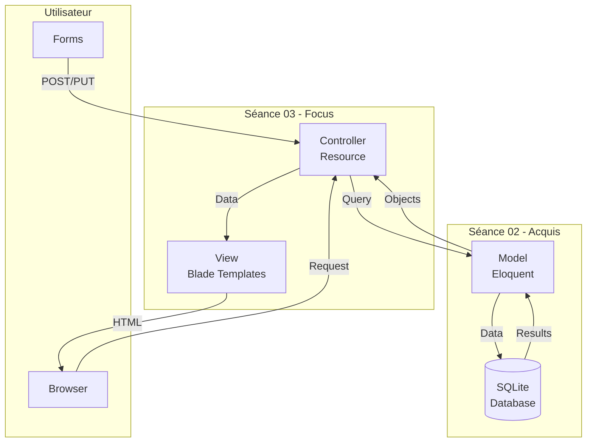

# 🧠 Concepts Fondamentaux - Séance 03

**Contrôleurs Avancés & Système de Vues dans Laravel**

---

## 🎯 Vue d'Ensemble

La séance 03 se concentre sur l'approfondissement de la couche **Contrôleur** et **Vue** de l'architecture MVC. Nous passons des routes simples aux contrôleurs resource complets avec un système de vues sophistiqué.

**Progression par rapport aux séances précédentes :**
- **Séance 01** : Routes simples → Contrôleurs basiques → Vues statiques
- **Séance 02** : Modèles Eloquent → Base de données SQLite → Relations simples (Livre→Catégorie)
- **Séance 03** : **Contrôleurs resource → Vues dynamiques → CRUD complet** ← Nous sommes ici
- **Séance 04** : Relations avancées → Many-to-Many → Auteurs multiples

---

## 🏗️ Architecture MVC Avancée

### **Le triangle MVC complet**



### **Évolution des Contrôleurs**

**Séance 01 - Contrôleurs Simples :**
```php
class LivreController extends Controller 
{
    public function index() {
        $livres = [/* données statiques */];
        return view('livres.index', compact('livres'));
    }
}
```

**Séance 03 - Contrôleurs Resource :**
```php
class LivreController extends Controller 
{
    public function index() { /* Afficher tous */ }
    public function create() { /* Formulaire création */ }
    public function store(Request $request) { /* Sauvegarder */ }
    public function show(Livre $livre) { /* Afficher un */ }
    public function edit(Livre $livre) { /* Formulaire édition */ }
    public function update(Request $request, Livre $livre) { /* Mettre à jour */ }
    public function destroy(Livre $livre) { /* Supprimer */ }
}
```

---

## 🛠️ Contrôleurs Resource

### **Concept CRUD**

**CRUD** = **C**reate, **R**ead, **U**pdate, **D**elete

| Action | Méthode HTTP | Route | Méthode Controller | Vue |
|--------|-------------|-------|-------------------|-----|
| **Lister** | GET | `/livres` | `index()` | `index.blade.php` |
| **Afficher** | GET | `/livres/{id}` | `show($id)` | `show.blade.php` |
| **Créer (form)** | GET | `/livres/create` | `create()` | `create.blade.php` |
| **Créer (save)** | POST | `/livres` | `store()` | *redirect* |
| **Modifier (form)** | GET | `/livres/{id}/edit` | `edit($id)` | `edit.blade.php` |
| **Modifier (save)** | PUT/PATCH | `/livres/{id}` | `update($id)` | *redirect* |
| **Supprimer** | DELETE | `/livres/{id}` | `destroy($id)` | *redirect* |

### **Génération Automatique**

```bash
# Génère un contrôleur avec toutes les méthodes CRUD
php artisan make:controller LivreController --resource

# Génère aussi le modèle associé
php artisan make:controller LivreController --resource --model=Livre
```

### **Route Resource**

```php
// routes/web.php
Route::resource('livres', LivreController::class);

// Équivaut à définir manuellement :
Route::get('/livres', [LivreController::class, 'index'])->name('livres.index');
Route::get('/livres/create', [LivreController::class, 'create'])->name('livres.create');
Route::post('/livres', [LivreController::class, 'store'])->name('livres.store');
Route::get('/livres/{livre}', [LivreController::class, 'show'])->name('livres.show');
Route::get('/livres/{livre}/edit', [LivreController::class, 'edit'])->name('livres.edit');
Route::put('/livres/{livre}', [LivreController::class, 'update'])->name('livres.update');
Route::delete('/livres/{livre}', [LivreController::class, 'destroy'])->name('livres.destroy');
```

---

## 🎨 Système de Vues Avancé

### **Organisation des Vues**

```
resources/views/
├── layouts/
│   ├── app.blade.php          # Layout principal
│   └── guest.blade.php        # Layout visiteurs
├── components/
│   ├── header.blade.php       # En-tête réutilisable
│   ├── footer.blade.php       # Pied de page
│   └── livre-card.blade.php   # Carte livre
├── livres/
│   ├── index.blade.php        # Liste des livres
│   ├── show.blade.php         # Détail d'un livre
│   ├── create.blade.php       # Formulaire création
│   └── edit.blade.php         # Formulaire édition
└── partials/
    ├── navigation.blade.php   # Menu navigation
    └── sidebar.blade.php      # Barre latérale
```

### **Templates Blade Avancés**

#### **Layout Principal**
```blade
{{-- resources/views/layouts/app.blade.php --}}
<!DOCTYPE html>
<html>
<head>
    <title>@yield('title', 'BiblioTech')</title>
    <meta name="viewport" content="width=device-width, initial-scale=1">
    <link href="https://cdn.jsdelivr.net/npm/bootstrap@5.3.0/dist/css/bootstrap.min.css" rel="stylesheet">
    @stack('styles')
</head>
<body>
    @include('partials.navigation')
    
    <main class="container mt-4">
        @if(session('success'))
            <div class="alert alert-success">{{ session('success') }}</div>
        @endif
        
        @if(session('error'))
            <div class="alert alert-danger">{{ session('error') }}</div>
        @endif
        
        @yield('content')
    </main>
    
    @include('partials.footer')
    
    <script src="https://cdn.jsdelivr.net/npm/bootstrap@5.3.0/dist/js/bootstrap.bundle.min.js"></script>
    @stack('scripts')
</body>
</html>
```

#### **Composants Blade**
```blade
{{-- resources/views/components/livre-card.blade.php --}}
@props(['livre'])

<div class="card mb-3">
    <div class="card-body">
        <h5 class="card-title">{{ $livre->titre }}</h5>
        <p class="card-text">{{ $livre->auteur }}</p>
        <p class="card-text">
            <small class="text-muted">{{ $livre->categorie->nom }}</small>
        </p>
        <a href="{{ route('livres.show', $livre) }}" class="btn btn-primary">Voir</a>
        @auth
            <a href="{{ route('livres.edit', $livre) }}" class="btn btn-secondary">Modifier</a>
        @endauth
    </div>
</div>
```

#### **Utilisation des Composants**
```blade
{{-- resources/views/livres/index.blade.php --}}
@extends('layouts.app')

@section('title', 'Catalogue des Livres')

@section('content')
<div class="row">
    <div class="col-md-12">
        <h1>Catalogue des Livres</h1>
        <a href="{{ route('livres.create') }}" class="btn btn-success mb-3">Ajouter un livre</a>
    </div>
</div>

<div class="row">
    @forelse($livres as $livre)
        <div class="col-md-4">
            <x-livre-card :livre="$livre" />
        </div>
    @empty
        <div class="col-12">
            <div class="alert alert-info">Aucun livre trouvé.</div>
        </div>
    @endforelse
</div>

{{ $livres->links() }}
@endsection
```

---

## 📝 Validation et Formulaires

### **Request Validation**

```php
// Dans le contrôleur
public function store(Request $request)
{
    $validated = $request->validate([
        'titre' => 'required|string|max:255',
        'auteur' => 'required|string|max:255',
        'isbn' => 'required|string|unique:livres|size:13',
        'categorie_id' => 'required|exists:categories,id',
        'resume' => 'nullable|string|max:1000',
        'date_publication' => 'required|date|before_or_equal:today'
    ]);

    $livre = Livre::create($validated);
    
    return redirect()
        ->route('livres.show', $livre)
        ->with('success', 'Livre créé avec succès !');
}
```

### **Affichage des Erreurs**

```blade
{{-- resources/views/livres/create.blade.php --}}
@extends('layouts.app')

@section('content')
<form action="{{ route('livres.store') }}" method="POST">
    @csrf
    
    <div class="mb-3">
        <label for="titre" class="form-label">Titre</label>
        <input type="text" 
               class="form-control @error('titre') is-invalid @enderror" 
               id="titre" 
               name="titre" 
               value="{{ old('titre') }}">
        @error('titre')
            <div class="invalid-feedback">{{ $message }}</div>
        @enderror
    </div>
    
    <div class="mb-3">
        <label for="categorie_id" class="form-label">Catégorie</label>
        <select class="form-select @error('categorie_id') is-invalid @enderror" 
                name="categorie_id">
            <option value="">Choisir une catégorie</option>
            @foreach($categories as $categorie)
                <option value="{{ $categorie->id }}" 
                        {{ old('categorie_id') == $categorie->id ? 'selected' : '' }}>
                    {{ $categorie->nom }}
                </option>
            @endforeach
        </select>
        @error('categorie_id')
            <div class="invalid-feedback">{{ $message }}</div>
        @enderror
    </div>
    
    <button type="submit" class="btn btn-primary">Créer</button>
</form>
@endsection
```

---

## 🔄 Messages Flash et Redirections

### **Messages de Session**

```php
// Redirection avec message de succès
return redirect()
    ->route('livres.index')
    ->with('success', 'Livre mis à jour avec succès !');

// Redirection avec erreur
return redirect()
    ->back()
    ->with('error', 'Une erreur est survenue.')
    ->withInput();
```

### **Affichage Automatique**

```blade
{{-- Dans le layout app.blade.php --}}
@if(session('success'))
    <div class="alert alert-success alert-dismissible fade show">
        {{ session('success') }}
        <button type="button" class="btn-close" data-bs-dismiss="alert"></button>
    </div>
@endif

@if(session('error'))
    <div class="alert alert-danger alert-dismissible fade show">
        {{ session('error') }}
        <button type="button" class="btn-close" data-bs-dismiss="alert"></button>
    </div>
@endif
```

---

## 🔗 Route Model Binding

### **Binding Automatique**

```php
// Au lieu de :
public function show($id) {
    $livre = Livre::findOrFail($id);
    return view('livres.show', compact('livre'));
}

// Laravel peut faire automatiquement :
public function show(Livre $livre) {
    return view('livres.show', compact('livre'));
}
```

**Avantages :**
- ✅ Code plus simple et lisible
- ✅ Gestion automatique des erreurs 404
- ✅ Type hinting pour l'autocomplétion
- ✅ Sécurité intégrée

---

## 📊 Pagination

### **Dans le Contrôleur**

```php
public function index()
{
    $livres = Livre::with('categorie')
        ->orderBy('titre')
        ->paginate(12);
        
    return view('livres.index', compact('livres'));
}
```

### **Dans la Vue**

```blade
{{-- Affichage des résultats --}}
@forelse($livres as $livre)
    <x-livre-card :livre="$livre" />
@empty
    <p>Aucun livre trouvé.</p>
@endforelse

{{-- Liens de pagination --}}
<div class="d-flex justify-content-center">
    {{ $livres->links() }}
</div>
```

---

## 🔍 Recherche et Filtres

### **Formulaire de Recherche**

```blade
<form method="GET" action="{{ route('livres.index') }}">
    <div class="row">
        <div class="col-md-6">
            <input type="text" 
                   name="search" 
                   value="{{ request('search') }}" 
                   placeholder="Rechercher un livre...">
        </div>
        <div class="col-md-4">
            <select name="categorie">
                <option value="">Toutes les catégories</option>
                @foreach($categories as $categorie)
                    <option value="{{ $categorie->id }}" 
                            {{ request('categorie') == $categorie->id ? 'selected' : '' }}>
                        {{ $categorie->nom }}
                    </option>
                @endforeach
            </select>
        </div>
        <div class="col-md-2">
            <button type="submit" class="btn btn-primary">Rechercher</button>
        </div>
    </div>
</form>
```

### **Dans le Contrôleur**

```php
public function index(Request $request)
{
    $query = Livre::with('categorie');
    
    if ($request->filled('search')) {
        $query->where('titre', 'like', '%' . $request->search . '%')
              ->orWhere('auteur', 'like', '%' . $request->search . '%');
    }
    
    if ($request->filled('categorie')) {
        $query->where('categorie_id', $request->categorie);
    }
    
    $livres = $query->orderBy('titre')->paginate(12);
    $categories = Categorie::orderBy('nom')->get();
    
    return view('livres.index', compact('livres', 'categories'));
}
```

---

## 📱 Responsive Design avec Bootstrap

### **Grille Responsive**

```blade
<div class="row">
    @foreach($livres as $livre)
        <div class="col-12 col-md-6 col-lg-4 col-xl-3 mb-4">
            <x-livre-card :livre="$livre" />
        </div>
    @endforeach
</div>
```

### **Navigation Mobile**

```blade
<nav class="navbar navbar-expand-lg navbar-dark bg-primary">
    <div class="container">
        <a class="navbar-brand" href="{{ route('home') }}">BiblioTech</a>
        
        <button class="navbar-toggler" type="button" data-bs-toggle="collapse" data-bs-target="#navbarNav">
            <span class="navbar-toggler-icon"></span>
        </button>
        
        <div class="collapse navbar-collapse" id="navbarNav">
            <ul class="navbar-nav me-auto">
                <li class="nav-item">
                    <a class="nav-link" href="{{ route('livres.index') }}">Catalogue</a>
                </li>
                <li class="nav-item">
                    <a class="nav-link" href="{{ route('categories.index') }}">Catégories</a>
                </li>
            </ul>
        </div>
    </div>
</nav>
```

---

## 🎯 Récapitulatif des Concepts

### **Nouveautés Séance 03**
- ✅ **Contrôleurs Resource** avec 7 méthodes CRUD
- ✅ **Route Model Binding** automatique  
- ✅ **Validation Laravel** avec messages d'erreur
- ✅ **Messages Flash** pour le feedback utilisateur
- ✅ **Composants Blade** réutilisables
- ✅ **Pagination** intégrée
- ✅ **Recherche et filtres** dynamiques
- ✅ **Interface responsive** avec Bootstrap

### **Architecture Complète**
```
Browser Request
     ↓
Route (Resource)
     ↓
Controller (CRUD)
     ↓
Model (Eloquent) → SQLite
     ↓
View (Blade) → Components
     ↓
HTML Response
```

### **Prochaine Étape**
La **Séance 04** abordera l'authentification et l'autorisation, permettant de sécuriser notre application et de gérer différents types d'utilisateurs.